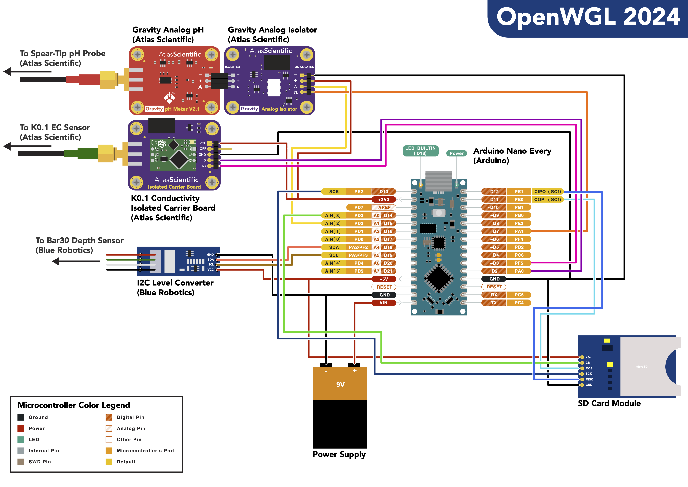

# OpenWGL

This is the codebase for the Open-Source Well Geochemistry Logger (OpenWGL) 2024 version. The WGL is a submersible sonde equipped with sensors for measuring depth, temperature, electrical conductivity (EC), and pH. The sonde is intended for deployment in groundwater monitoring wells measuring \>2" in diameter.

The WGL consists of a pressure-rated aluminum cylinder which houses the onboard electronics unit. This electronics unit is powered by the Arduino Nano Every microcontroller platform. The microcontroller interfaces with a Blue Robotics Bar30 sensor, an Atlas Scientific K0.1 EC sensor, and an Atlas Scientific Gravity Analog pH Sensor. The pH sensor is electrically isolated from the EC sensor with an Atlas Scientific Gravity Analog Isolator Board.

Version `1.0` of the WGL was successfully field-deployed in January 2023, being submerged up to 300m depth, and profiling electrical conductivity across a hyperalkaline well. Version `5.0` is a significantly downsized version. Its hull diameter has been reduced from 75mm to 50mm and its microcontroller downsized from an Arduino Uno to the more powerful Arduino Nano Every.

This code was developed by Tristan Caro, Harry Brodsky, and Eric Ellison at the University of Colorado Boulder, Department of Geological Sciences, with support from Alexis Templeton.

The OpenWGL is published under a [CC-BY license](https://creativecommons.org/licenses/by/4.0/deed.en).
For questions, contact Tristan Caro: tristan.caro@colorado.edu

## Bill of Materials

**Hull**

-   Aluminum - 300 mm x 50mm (ID) Watertight Enclosure. Depth rating: 950 m. (Blue Robotics). (x1)

-   Aluminum Flange Cap - 50mm (ID) - Blank. (Blue Robotics). (x1)

-   Aluminum Flange Cap - 50mm (ID) - 4 x M10 hole. (Blue Robotics). (x1)

-   Pressure Relief Valve (M10). (Blue Robotics). (x1)

-   WetLink Cable Penetrator (M10, 4.5mm, HC). (Blue Robotics). (x2)

-   M10 Connector Blank. (Blue Robotics). (x0 or x1, depending on how many sensors)

**Electronics**

-   Arduino Nano Every. (Arduino). (x1)

-   Atlas Scientific K0.1 Kit. (Atlas Scientific) (x1) includes:

    -   EZO Conductivity Circuit (x1)

    -   K.01 Conductivity Probe (x1)

    -   EZO Carrier Board (x1)

-   HiLetgo Micro SD TF Card Reader Module (6 Pin SPI Interface). (x1)

-   Micro SD Card. (x1)

-   Bar30 High-Resolution 300m Depth/Pressure Sensor. (Blue Robotics). (x1)

-   I2C Level Converter (Blue Robotics) (x1)

-   JST GH to DF13 Adapter. (Blue Robotics). (x1)

## Pinout Diagram

